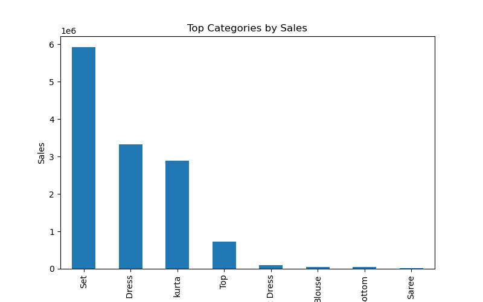
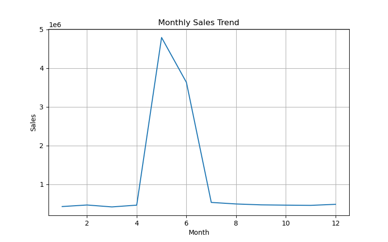

# 📊 E-commerce Sales Analysis Project

End-to-end E-commerce Sales Analysis Project using Python, SQL, and Power BI

## 📌 Project Overview
This project focuses on analyzing real-world e-commerce sales data to generate actionable business insights. The goal is to understand revenue trends, product performance, customer behavior, and operational efficiency.

The analysis is performed using Python for data cleaning and exploration, SQL for data querying concepts, and Power BI for interactive dashboard visualization.

---

## 🎯 Objectives
- Analyze overall sales performance
- Identify top-performing products and categories
- Track monthly revenue trends
- Evaluate fulfillment methods
- Generate business insights for decision-making

---

## 🛠️ Tools & Technologies
- **Python** (Pandas, Matplotlib)
- **SQL** (for data querying and aggregation)
- **Power BI** (for dashboard visualization)
- **Jupyter Notebook**

---

## 📂 Project Structure

ecommerce-analysis/
│
├── data/
│   └── Amazon Sale Report.csv
│
├── notebook/
│   └── analysis.ipynb
│
├── images/
│   ├── category_sales.png
│   ├── monthly_sales.png
│
└── README.md

---

## 🔍 Data Cleaning & Preparation
- Converted date column into datetime format
- Removed missing values
- Renamed columns for better readability
- Created new features such as Month for trend analysis

---

## 📊 Exploratory Data Analysis (EDA)

### 📌 Top Categories by Sales

### 📌 Monthly Sales Trend

---

## 💡 Key Insights
- A small number of categories contribute the majority of revenue
- Sales show clear monthly trends and seasonality
- Certain fulfillment methods generate higher revenue
- Top products significantly impact overall business performance

---

## 🧠 SQL Queries (Simulated)

### Total Revenue
SELECT SUM(Amount) AS Total_Revenue
FROM amazon_sales;

### Top 10 Products by Sales
SELECT SKU, SUM(Qty) AS Total_Quantity, SUM(Amount) AS Total_Sales
FROM amazon_sales
GROUP BY SKU
ORDER BY Total_Sales DESC
LIMIT 10;

### Revenue by Category
SELECT Category, SUM(Amount) AS Category_Revenue
FROM amazon_sales
GROUP BY Category
ORDER BY Category_Revenue DESC;

---

## 📈 Dashboard
An interactive Power BI dashboard was created to visualize:
- Sales trends over time
- Product and category performance
- Fulfillment analysis

---

## 🚀 How to Run the Project
1. Open `notebook/analysis.ipynb` in Jupyter Notebook
2. Ensure dataset is placed inside the `data/` folder
3. Run all cells step by step
4. Visualizations will be displayed and saved in the `images/` folder

---

## ✅ Conclusion
This project demonstrates a complete end-to-end data analysis workflow, from raw data processing to business insights and visualization. It highlights key analytical skills required for a Data Analyst role.

---

## ⚠️ Disclaimer
This project is based on a publicly available dataset and is implemented for learning and portfolio purposes.
